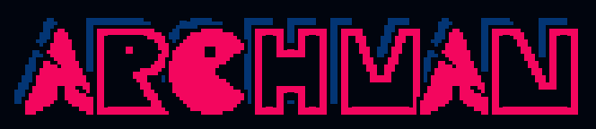

  

# Arch Linux + KDE Plasma installer

An installer on a USB stick, the ARCHMAN USB, for a UEFI machine: Btrfs root with `@`/`@home`
subvolumes, RAM-sized swap with working hibernation, GRUB, a minimal KDE
Plasma desktop, GPU drivers (64- and 32-bit), Steam, and a handful of AUR
packages. In English (US), with the timezone, date formats and keyboard of
where it's installed (the keyboard is asked, that one first) — see `config.sh`.

## Quick start

The ARCHMAN USB is the only way to install. On an Arch machine, build it
from the official Arch ISO (fetched for you), write it to a stick and boot
the computer from it:

    sudo pacman -S --needed libisoburn squashfs-tools devtools git curl gum
    sudo tools/build-autoinstall-iso.sh
    sudo dd if=archlinux-autoinstall.iso of=/dev/sdX bs=4M status=progress oflag=sync

It boots straight into the installer. Without a cable, pick your Wi-Fi
network from the list it shows. Then pick your keyboard layout (the one of
where you are comes first) and answer three prompts (hostname, username, and one password used for both
your user and root),
pick the drive from an arrow-key menu, type `YES`, and walk away. The
installer sets up everything, desktop included, then asks one last thing:
the ARCHMAN look (dark theme, its own login screen, wallpaper, icons, a top
panel and a clock widget) or plain KDE Plasma, as it comes. Then it asks
you to remove the USB and reboots as soon as you unplug it (or press
Enter): straight into SDDM, where the first Plasma session applies the
desktop tweaks. One reboot, and no prompts between the first screens and
that last question.

The installer itself is fetched from this repo at boot, from the `REPO`
and `BRANCH` in `config.sh` baked into the USB. For a USB that installs
from another branch: `sudo BRANCH=clauding tools/build-autoinstall-iso.sh`.

**This erases the selected drive.** Test in a VM first.

### The USB

`tools/build-autoinstall-iso.sh` turns the official Arch ISO into the
ARCHMAN USB. It has no boot menu (on UEFI): it boots
straight in, quietly — no kernel or systemd messages and no login text —
and shows the ARCHMAN logo across two thirds of the screen
(`tools/fb-logo.py`, drawn on the framebuffer), with "Checking if this
computer is ready..." under it 2 seconds in. The logo stays up while the
network comes up and through the installer's own checks (UEFI, internet,
fetching gum), which draw nothing over it, for at least 4 seconds in all;
the first thing after it is the account screen.

With no cable plugged in, on a machine with Wi-Fi, it shows the networks in
range instead, strongest first, each with its signal and whether it's
secured: pick one with the arrow keys, type its password, and the splash
comes back. The new system gets the same network (as a NetworkManager
connection), so it's online from its first boot. If there's no Wi-Fi
either, it waits up to 30 seconds for a cable. Whatever goes wrong, it says
so in plain words, what to do about it, and restarts on Enter: no shell or
commands on screen. (To dig in: Alt+F2 for another console, root, no
password.)

    sudo pacman -S --needed libisoburn squashfs-tools devtools git curl gum
    sudo tools/build-autoinstall-iso.sh

The AUR packages that compile from source (`AUR_PACKAGES` without the
`-bin` ones: qview) are built into the USB, in a clean chroot with
devtools' `makechrootpkg` (created once in `/var/lib/archman-build`, about
200 MB, and updated on every run), so installs from it don't spend minutes
compiling them. Without devtools, or when run as root rather than through
sudo, that step is skipped and installs compile them as before. An install
still builds a package itself when the AUR has a newer version than the
USB's, or if the prebuilt one won't install.

Run with no arguments it asks whether to fetch the current official ISO or
use one you already have. `--download` skips the question for scripted use,
and an explicit path still works as before:

    sudo tools/build-autoinstall-iso.sh --download my-autoinstall.iso
    sudo tools/build-autoinstall-iso.sh archlinux-x86_64.iso archlinux-autoinstall.iso

Downloads land in the current directory under their dated release name, are
checked against the mirror's `sha256sums.txt` and GPG-verified against the
pacman keyring, and are reused instead of re-fetched on later runs. The
mirror is `ISO_MIRROR` in `config.sh`.

## How it fits together

    bootstrap.sh             fetched by the USB at boot: the repo tarball to /tmp, then setup.sh install
    setup.sh <phase>         single entry point; loads config + lib, runs one phase
    config.sh                every tunable value: locale, disk, package lists, theme
    assets/logo/             the logo drawn above every step (tools/make-logo.py): logo.txt,
                             logo-hd.txt at double resolution for the console, their .colors,
                             and banner.png for this README (tools/make-sddm-theme.py)
    assets/plymouth/         the boot splash theme: script, logo, spinner
    assets/sddm/archman/     the login screen: an Omarchy-style unlock screen, as an SDDM theme (tools/make-sddm-theme.py)
    assets/consolefonts/     the console fonts, with Pac-Man, a padlock and the bar's eighths added (tools/make-console-fonts.py)
    lib/ui.sh                console font/palette, centred step screens, run() spinner + setup.log
    lib/prompt.sh            validated input, passwords, arrow-key menu, buttons
    lib/system.sh            CPU/GPU detection, pacman/AUR/service helpers
    lib/keyboard.sh          the keyboard layouts and their question (Wi-Fi screen or install phase)
    phases/install.sh        live ISO: partition, format, pacstrap (+ CPU/GPU drivers), hand off to chroot
    phases/chroot.sh         locale, accounts, sudo, hibernation, GRUB, then runs desktop.sh as the user
    phases/desktop.sh        the desktop, as the user in the chroot: Plasma, theming, Samba, Steam, AUR
    phases/look.sh           the chosen look, system-wide: login screen, default wallpaper
    phases/wifi.sh           live ISO: the Wi-Fi network list, run by the USB before the installer
    phases/plasma-tweaks.sh  first Plasma session: kwin, theme, widgets, panel, icons

The installer directory travels with the install: `/tmp/arch-setup` on the
ISO → `/root/arch-setup` in the chroot → `~/.arch-setup` for the desktop
phase (still in the chroot) and the Plasma first-login step, which then
deletes it, leaving only `~/arch-setup.log`.

Every command that goes through `run()` is logged there, with its full
output shown on the terminal only if it fails.

## Configuration

Everything lives in `config.sh`: the installer's tagline and console
palette (`TAGLINE`, `CONSOLE_PALETTE`), timezone and date formats (both detected by default), language (`LOCALE`), mirror
countries, EFI size, Btrfs mount options, the package lists (`BASE_`,
`KDE_`, `EXTRA_`, `GAMING_`, `AUR_PACKAGES`, per-vendor `GPU_PACKAGES_*`),
the surround-upmix settings (`UPMIX_*`), the SDDM theme and wallpaper, icon
theme, Plasma widgets, and the Samba workgroup.

## Design notes

Things that look odd but are deliberate:

- **Passwords** are written to a root-only `creds` file inside the staged
  installer for the chroot phase (deleted first thing there, and by a trap
  if the chroot never starts), then fed to `chpasswd` on stdin — they never
  appear in argv, the environment, or the log.
- **32-bit GPU drivers are installed before Steam.** `steam` depends on the
  virtual `lib32-vulkan-driver`, and `pacman --noconfirm` picks the first
  provider — `lib32-nvidia-utils`, which pulls the whole NVIDIA userspace
  even on AMD/Intel. Having the right provider installed first avoids that.
  With no Intel/AMD/NVIDIA GPU detected (VMs), only plain `mesa` is installed
  and Steam is skipped: software Vulkan (`vulkan-swrast`) would satisfy the
  dependency, but a 64-bit Vulkan device makes the SDDM theme's video
  background render blank under VirtualBox. The drivers come with the base
  system (pacstrap), so they're in place before the desktop phase's
  transaction that brings Steam.
- **The desktop phase installs from the official repos in one pacman
  transaction**: `KDE_PACKAGES`, `EXTRA_PACKAGES`, `GAMING_PACKAGES` (when
  there's a GPU), plus base-devel. The lists stay separate in
  `config.sh`; one transaction means pacman's checks and post-install hooks
  (font, icon and desktop caches) run once instead of once per list. From
  the installer it's `pacman -S`: pacstrap synced the package lists moments
  before, so there's nothing to update. The installer also has pacman download `PARALLEL_DOWNLOADS` files at once
  (10; pacman's default is 5), set in the USB's `pacman.conf`, which
  pacstrap copies into the new system.
- **Surround upmixing is written twice**, to
  `/etc/pipewire/client.conf.d/` and `/etc/pipewire/pipewire-pulse.conf.d/`.
  PipeWire mixes channels in the client library, so the native path (mpv,
  Zen) and the PulseAudio path each need their own copy — configure one and
  half your applications silently stay stereo. Upmixing is off in stock
  PipeWire: without this, a stereo stream on a 5.1/7.1 card only ever
  reaches front L/R. `lfe-cutoff`/`fc-cutoff` have to be set explicitly too;
  left at their defaults the subwoofer and centre stay silent even with
  `channelmix.upmix = true`. Nothing is set for mpv on purpose — forcing
  `audio-channels=7.1` makes mpv pad the extra channels itself, so PipeWire
  sees 8 channels and skips the upmix.
- **The timezone is where the machine is, never asked.** With
  `TIMEZONE='auto'` (the default), the install phase looks the machine's
  public IP up at ipinfo.io once, under the splash, and takes the timezone
  it gives (the country from the same answer ranks the mirrors, below). A
  lookup that fails, or a zone the system doesn't know, gives UTC; it can be
  changed later in System Settings. A VPN shows its own location. A fixed
  zone in `config.sh`, e.g. `'Europe/Lisbon'`, is used as it is.
- **The keyboard layout is asked, the local one first.** The list is
  Omarchy's (its shared setup form), less its Lao and Azerbaijani entries,
  whose keymaps there belong to other layouts. The layout of the country
  from the location lookup (`COUNTRY_KEYBOARD`) leads, then English (US),
  then the rest alphabetically; English (US) leads where there's no match.
  It's loaded on the console at once, so the password that follows is typed
  with it. Each layout carries its console keymap and its X11 layout and
  variant (from systemd's `kbd-model-map`), for Plasma and the login screen;
  layouts without Latin letters come with US as a second one (both Shift
  keys switch), so a Latin password still works at the login screen.
  Without a cable, the question comes first on the USB's Wi-Fi screen
  instead, so the Wi-Fi password is typed with the right layout: with no
  network there's no location yet, so English (US) leads, then the rest
  alphabetically. The installer keeps that choice (`/run/archman-keyboard`)
  and asks again only on starting over. The Wi-Fi password field shows what
  is typed on Tab, and refuses a password that isn't 8 to 63 characters.
- **English everywhere, dates the local way.** The language is English (US)
  throughout (`LOCALE`: `LANG=en_US.UTF-8`), never asked. Dates and times
  alone (`LC_TIME`, `TIME_LOCALE='auto'`) follow the country from the same
  lookup: its locale in its main language if glibc has one (`pt_PT`,
  `es_ES`), else its English one (`en_GB`, `en_IN`), else the first glibc
  lists, with a short table (`MAIN_LANGUAGE`) for countries where that
  first isn't the main language (Brazil, China, Ukraine...). So day/month
  order, 24-hour time and the first day of the week are local; written-out
  month and day names come in that locale's language. Unknown country, or a
  locale the new system lacks: US formats.
- **Mirrors are picked by location.** With `MIRROR_COUNTRIES='auto'` (the
  default), the install phase takes the country of the machine's public IP
  from the same ipinfo.io lookup as the timezone and has reflector rank that
  country's HTTPS mirrors; if the lookup fails or the country has none, it
  ranks mirrors worldwide. A list such as `'PT,ES'` pins the countries.
  Only mirrors at most 4 hours behind Arch are used (`--delay 4`): pacman
  reads the package lists from the first mirror alone, and a fast but stale
  one lists versions the others have already deleted, so every download
  404s. `--age` doesn't catch that, as a mirror can sync often from a stale
  source. Arch's own CDN (`geo.mirror.pkgbuild.com`) always comes last, for
  a file the mirrors above haven't synced yet.
- **Microcode and GPU drivers go in with `pacstrap`**, so the first
  initramfs and `grub.cfg` already include them and nothing needs
  regenerating later; an NVIDIA machine runs `nvidia-open` from its very
  first boot rather than nouveau. That needs multilib (for the 32-bit
  drivers) enabled before `pacstrap`: the install phase turns it on in the
  live ISO's `pacman.conf`, which `pacstrap` reads, and `pacstrap -P` copies
  that config into the new system.
- **The desktop phase runs inside the chroot, not on a first boot.** Nothing
  it does needs the new system running: packages install from the live
  system's network, services are enabled without being started (the
  first boot starts them), and AUR builds run as the user (`runuser`), on
  disk rather than in the chroot's RAM-backed `/tmp`. A temporary
  `NOPASSWD` sudo rule (`/etc/sudoers.d/90-arch-setup-install`, removed
  afterwards) stands in for the password, also for makepkg's own sudo
  calls, and the progress bar carries on from the install phase's.
- **The live ISO reboots with `systemctl reboot --force --force`**, after
  the new system is unmounted and synced: nothing on the ISO needs a clean
  shutdown, and one was screens of status lines and a 90 s wait for the
  Wi-Fi daemon, which ignores SIGTERM. The double force reboots at once.
- **The login screen is an Omarchy-style unlock screen, in the installer's
  look.** `assets/sddm/archman` is an SDDM theme in QML: the logo, padlock
  and password dots are images rendered with the patched console
  font (`tools/make-sddm-theme.py`), shown at a whole-number scale with
  smoothing off, and colours and tagline come from `config.sh`. Rerun the
  tool after changing the logo, fonts, palette or tagline. It logs in the
  last user, or on the first login the only one, into the default session.
  The astronaut theme is still installed: the wallpapers come from it, and
  it can be picked in System Settings. SDDM's greeter runs on X11 and
  ignores Plasma's keyboard setting, so the chosen layout is also written to
  `/etc/X11/xorg.conf.d/00-keyboard.conf`, or the password would be typed
  on a US layout.
- **The Wi-Fi screen runs from the USB, not from GitHub**: without a
  network the installer can't be downloaded, so the USB carries a copy of
  what the screen needs (`setup.sh`, `config.sh`, `lib/`,
  `phases/wifi.sh`, the logo and fonts) and gum. The networks come from
  iwd over D-Bus (`busctl`, read with python3), which gives each one's
  name, kind and signal as data rather than `iwctl`'s coloured table;
  connecting goes through `iwctl`, with the password passed in a variable,
  not on `run`'s logged command line. The install phase turns every
  network iwd remembers (`/var/lib/iwd`) into a root-only NetworkManager connection on the new system.
- **The look is chosen at the very end**, after everything is installed,
  so the install itself stays unattended, and its time doesn't count the
  wait for an answer. Both looks' files are installed either way (they stay
  available in System Settings); the choice only decides what's switched
  on: the login screen and default wallpaper right away (`phases/look.sh`,
  as root through arch-chroot), the dark theme, lock screen, widgets, panel
  and icons in the first Plasma session (plasma-tweaks reads the choice from
  `look` in the installer's directory). Hot corners, Dolphin's previews,
  the keyboard layout and the boot splash are the same with both.
- **plasma-tweaks is autostarted, not run from desktop.sh**, because Plasma writes
  several of the config files it edits during its own startup. The
  containment and applet IDs it uses come from Plasma's stock first-session
  layout. Each tweak runs on its own: one that fails is logged and skipped,
  and the rest still apply.
- **The installer restyles the console** while it runs (on a real tty only,
  `TERM=linux`): it picks the largest of three stock kbd fonts that keeps
  about 48 rows and 80 columns, so text isn't tiny on high-resolution
  screens, and swaps the 16 VGA colours for `CONSOLE_PALETTE`. The fonts
  are copies from `assets/consolefonts` with two unused glyphs redrawn as
  Pac-Man: `ᗧ`, the tag on every message, and `⬤`, its closed mouth, which
  the spinner alternates with it while eating a row of pellets. They also
  carry the login screen's padlock, Omarchy's lock shape
  redrawn as a block of 5×3 tiles (U+E000–U+E00E), 80% as tall as the
  password box beside it. No stock console font has any of these;
  `tools/make-console-fonts.py` rebuilds the copies.
- **Fonts are loaded only after printing a visible character.** Arch's
  kernel defers the framebuffer console's takeover until something is
  printed (`CONFIG_FRAMEBUFFER_CONSOLE_DEFERRED_TAKEOVER`, for flicker-free
  boots). After a quiet boot nothing has been, so the console is still the
  placeholder `dummycon`, and every `setfont` fails with kbd's misleading
  "Unable to load such font with such kernel version" (`ENOSYS`).
  Escape sequences and spaces don't count: `dummycon` ignores both. So
  `scale_console_font` and the USB's splash print a `.`, erase it, and retry
  `setfont` until the takeover (asynchronous) has happened.
  If loading still fails, setfont's error is in `journalctl -b -t arch-setup`.
- **The console gets a double-resolution logo.** Plain console characters
  go no finer than half blocks, two pixels per cell, which is `logo.txt`.
  The style is the classic arcade title: pink letters over a blue copy of
  themselves shifted up and left (the extrusion), each inside a thin dark
  outline that separates it from the extrusions, set edge to edge. H is
  pixel art and M and N solid blocks with a notch cut from the top (the
  M's V, the N's diagonal); the R is the original's outline (a round
  bowl, a waist, the leg out to the corner) with a dot inside. All are drawn as a thick outline with a
  dark inside; the C is
  a solid Pac-Man with his eye cut out; the A's are the Arch Linux logo's
  mark, kept solid, rasterised from the copy in `/usr/share/pixmaps`
  (thickened a pixel, with its two slivers cut back in). A console cell
  has only two colours, its character's and its background's: the
  `.colors` file gives each cell its pair (pink on blue where a letter
  meets its extrusion), from palette slots 0–7 only, which 512-glyph fonts
  keep; in a terminal emulator the same colours go out as 24-bit RGB. The
  plain `logo.txt` is the same design with solid letters: at half the
  resolution there's no room for outlines.
  Doubling the console logo's resolution again would take about 150 cell
  glyphs, more than a 256-character console font has room for.
  `tools/make-logo.py` draws the logo at 158×28 pixels instead, 2×4 per
  cell, and writes `logo-hd.txt`: each cell that isn't empty, full or a
  half block is a private-use character (U+E100 + its pixel pattern), and
  `tools/make-console-fonts.py` draws those patterns into the fonts. It's
  shown only once a patched font is loaded (by the install phase, as root;
  it tells the chroot and desktop phases through `PATCHED_FONT`), and
  `logo.txt` everywhere else, such as in a terminal emulator. Each step
  then clears the screen and redraws the logo, a progress bar and the step
  title in one centred column; earlier output stays in the log, which is
  why `warn` writes there too. None of this persists after a reboot.
- **The progress bar is weighted and keeps moving.** Each step carries a
  weight, roughly its seconds (`step "Installing the desktop and apps" 80`), so long
  steps take their share of the bar. The weights are one full run's times on
  a fast connection; a slower one stretches the download steps, but pacman's
  measured progress keeps those moving. A step running several long commands
  splits into shares, one per command (`share 50 250`), so the first to
  finish can't fill the step and leave the bar standing through the rest.
  Within a share, the bar never stands still: it creeps towards 95% of the
  share from wherever it is, slowing as it gets closer (three quarters of
  the way at the share's expected time, still moving long after), and goes
  further whenever the running command reports real progress. pacman's is
  read from its output: the download, as the growth of its package cache
  against the `Total Download Size` it announces (so the bar keeps your
  connection's pace); then its integrity, conflict and disk-space checks;
  then its `installing <name>...` lines against the `Packages (N)` it
  announces (written to a file, pacman prints no `(n/N)` counts). `git
  clone` reports its own percentage. makepkg reports nothing usable (its
  pacman output is only the dependencies), so a build creeps. The chroot and
  desktop phases carry on the bar exactly where the install phase left it
  (`progress_env`); nothing that moves it runs in a subshell, where its
  progress would be lost and the bar would jump back. The bar doesn't jump
  to a new estimate but glides there, 20 frames a second, covering a tenth
  of the remaining distance each frame (`animate_progress`). It moves an
  eighth of a cell at a time, its edge one of `▏▎▍▌▋▊▉`: a pixel at a time
  in the 8-pixel-wide console font. The patched fonts add those characters;
  with a stock console font the bar moves a whole cell at a time. Only the
  bar's line is redrawn. Adding a step means giving it a weight; the totals
  add themselves up (`step_weights`). Each step's real duration goes into
  the log next to its weight, and a split step's shares too, for tuning:
  `grep '\[time\]' setup.log`.
- **Prompts use [gum](https://github.com/charmbracelet/gum), which the USB
  carries** (copied from the machine that builds it; it needs only glibc).
  It's used once `gum --version` succeeds; should it not start, the plain
  prompts in `lib/prompt.sh` take over. Esc asks again, Ctrl+C aborts.
  Typing `YES` to erase the drive stays plain typed text on purpose.
- **Boot is quiet, behind a Plymouth splash.** The chroot phase adds the
  `plymouth` hook right after `systemd`/`udev`, `quiet splash` to the kernel
  options, and its own `archman` theme (`assets/plymouth`): Arch's logo
  where firmware logos sit and a spinner, on black. It's a Plymouth script
  theme, so `archman.script` can size both from the screen height: the logo
  is 24.5% of it (196 px at 1280×800, the size of VirtualBox's firmware
  logo), and the images are rendered large enough for 4K and only scaled
  down. Press Esc during boot to see the
  messages. On NVIDIA the driver modules go into the initramfs too, so the
  splash has a display that early.
- The live USB is filtered out of the drive menu, and `udevadm settle`
  runs after partitioning so the new device nodes exist before they're used.

## Annex: installed packages

Grouped as they appear in `config.sh`, which is the source of truth — this
table is a description of those lists, not a second copy of them.

### `BASE_PACKAGES` — pacstrapped onto the new root

| Package | Purpose |
|---|---|
| `base` | Core meta-package for a minimal Arch system (glibc, pacman, systemd) |
| `linux` | The main Linux kernel |
| `linux-firmware` | Firmware blobs for hardware devices (Wi-Fi, GPU, etc.) |
| `btrfs-progs` | Btrfs filesystem tools, needed for the `@`/`@home` subvolumes |
| `grub` | Bootloader |
| `efibootmgr` | UEFI boot manager, required by GRUB in UEFI mode |
| `nano` | Simple text editor, so the installed system is usable before a desktop exists |
| `networkmanager` | Network management daemon (Wi-Fi, Ethernet, VPN) |
| `sudo` | Lets the created user run commands as root |
| `plymouth` | Boot splash (the `archman` theme) instead of scrolling boot messages |
| `pciutils` | `lspci`, for the GPU check that decides on Steam (the desktop phase runs in the chroot, on the new system's tools) |

CPU microcode (`intel-ucode` / `amd-ucode`) is added here too, picked from the
detected vendor — see the design note on why it goes in at this stage.

### GPU drivers — `GPU_PACKAGES_*`, by detected vendor, pacstrapped too
  The same splash covers reboot and power-off (Plymouth's own shutdown
  units). Around it, the text console shows for a moment, so it's kept
  blank: `vt.global_cursor_default=0` hides its cursor, and
  `/etc/sysctl.d/20-quiet-printk.conf` keeps kernel warnings off it for the
  whole session (`loglevel=3` only lasts through boot).
- **Intel** — `mesa`, `lib32-mesa`, `vulkan-intel`, `lib32-vulkan-intel`,
  `intel-media-driver`: graphics drivers (64- and 32-bit), Vulkan, and
  hardware video decode/encode
- **AMD** — `mesa`, `lib32-mesa`, `vulkan-radeon`, `lib32-vulkan-radeon`,
  `radeontop`: the same, plus a GPU usage monitor
- **NVIDIA** — `nvidia-open`, `nvidia-utils`, `lib32-nvidia-utils`,
  `nvidia-settings`, `opencl-nvidia`: open kernel modules plus the userspace
  driver (64- and 32-bit), config GUI, OpenCL. `nvidia-open` drives Turing
  (RTX 20xx) and newer only; older cards fall back to nouveau, since the
  proprietary package no longer exists in the repos.
- **Fallback** (VMs, unrecognised hardware) — `mesa`, `lib32-mesa` only.
  Deliberately no software Vulkan: see the design note above.

Hybrid setups get every matching vendor. The 32-bit halves are what Steam
needs, and installing them first is what stops pacman pulling the NVIDIA
userspace onto an AMD or Intel machine.

### `KDE_PACKAGES` — the desktop

**Core Plasma**
- `plasma-desktop` — Plasma shell, panels, widgets, workspace
- `sddm` — Login screen (display manager)
- `sddm-kcm` — KDE settings module for configuring SDDM
- `kscreen` — Display configuration and multi-monitor support

**System tray & management**
- `plasma-pa` — Audio volume control
- `plasma-nm` — Network management
- `plasma-systemmonitor` — System resource monitor
- `kwalletmanager` — Password and credential manager (KWallet)

**Hardware & connectivity**
- `bluedevil` — Bluetooth support and tray applet
- `kdeconnect` — Phone integration (notifications, file sharing, remote control)
- `kdenetwork-filesharing` — The "Share" tab in Dolphin, for Samba shares

**Applications**
- `konsole` — Terminal emulator
- `dolphin` — File manager
- `ark` — Archive manager (zip, 7z, rar, …)
- `featherpad` — Lightweight text editor
- `kio-admin` — Lets Dolphin edit root-owned files behind a polkit prompt,
  instead of running a whole file manager as root

**Multimedia & thumbnails**
- `kdegraphics-thumbnailers` — Thumbnails for images and PDFs
- `ffmpegthumbs` — Video thumbnails in Dolphin
- `pipewire-jack` — JACK audio support via PipeWire

### `EXTRA_PACKAGES` — applications and fonts

- `fastfetch` — System information display
- `mpv` — Lightweight, scriptable video player
- `krdc` — Remote desktop client (VNC/RDP)
- `krdp` — Remote desktop server (RDP)
- `git` — Version control
- `code` — The open-source build of Visual Studio Code
- `ttf-liberation` — Metric-compatible Arial / Times New Roman / Courier New
- `noto-fonts-cjk` — Chinese, Japanese and Korean coverage
- `ntfs-3g`, `exfatprogs`, `dosfstools` — format and repair NTFS, exFAT and
  FAT32. Only formatting and repair need these; mounting works without them.

### `GAMING_PACKAGES` and `AUR_PACKAGES`

- `steam` — Installed only when a real GPU was detected, and after the 32-bit
  drivers, for the reason in the design notes. Needs the multilib repo, which
  the install phase enables.
- `base-devel` — Build tools, required to compile anything from the AUR
  (built with `MAKEFLAGS=-j$(nproc)`: makepkg.conf leaves it to one core)
- `zen-browser-bin` (AUR) — Firefox-based privacy-focused browser
- `qview` (AUR) — Lightweight, fast image viewer
